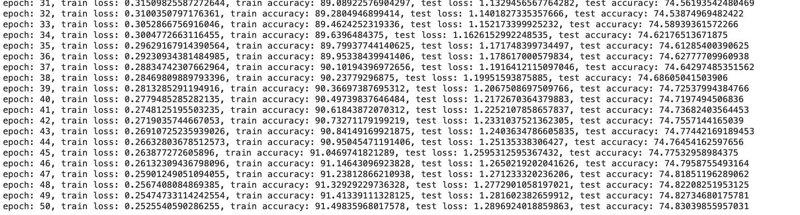

# AI502: Deep Learning
#### Homework #1 
#### EuiYul Song (20214426)
#### Jiyeon Han
#### JaeSik Choi

## Goal
#### Implement a fully connected neural network and convolutional neural network to classify CIFAR10 dataset with various loss functions and optimizers

## Purpose
#### Promote learning and growth on myself through construction of these models, and on others by sharing reusable codes on a social media

## Ideation

## User Persona and Scenario

## Gantt Chart

## Model Selection

### CNN

I used first three blocks of the VGG16 model consisted of Conv2D and MaxPooling layers to build a CNN class, optimized with Adam, and used categorical cross entropy as a loss function. This model was run with epoch of 10 and the model showed low training and test accuracy, implying high bias and variance. Thus, I increased the epoch to 50; added L2 activity regularizer, and L1 kernel regularizer on the Dense layers; appended He uniform kernel initializer on the Conv2D layers. I also experimented the CNN model with MSE, Categorical Hinge, and Adagrad, but they were more over-fitted and under-fitted than Adam and Categorical Cross Entropy did. Hence, I maintain Adam and SCC for the final CNN. The final model settings, and its loss and accuracy plot of the CNN model are as follows:

Setting

Structure

Accuracy

Plot

### FCNN

I intuited that maintaining the regularizers, model structures, optimizer, and loss function of the CNN model on the FCNN model will yield best performance, and the FCNN will have less performance than the CNN have. My intuition was correct that 3 block architecture, an Adam optimizer, and a Sparse Categorical CrossEntropy loss function showed best training and test accuracy when tested with other optimizers, model structures, and loss functions. Also, the FCNN had lower training and test accuracy than the CNN had when tested with same hyper-parameters.The final results are:

Setting

Structure

Accuracy

Plot

## Comparison between FCNN and CNN

#### Comparison
| Metric | CNN | FCNN |
| :---: | :---: | :---: |
| train loss | 0.25 | 1.53 |
| train accuracy | 0.91 | 1.44 |
| test loss | 1.29 | 1.63 |
| test accuracy | 0.75 | 0.42 |
| number of parameters  | 698,154 | 148,298 |

#### Interpretation
The CNN trained well on its data but it okay when tested. Thus, simplifying the model, adding early stopping, using data augmentation, and adding dropouts are recommended for the future usages.

## Affecting parameters

| Parameter | definition | effect on training |
| :---: | :---: | :---: |
| epoch | the number of passes of the entire training dataset | prevents underfitting (too few epoch) and overfitting (too many epoch) |
| optimizer | a method that changes the attributes of the model (weight, learning rate, etc) | reduces (good choice) or increases (bad choice) losses to improve accuracy |
| batch size | the number of training examples utilized in one iteration | controls the accuracy of the estimate of the error gradient; larger batch sizes can train faster and require less memory |